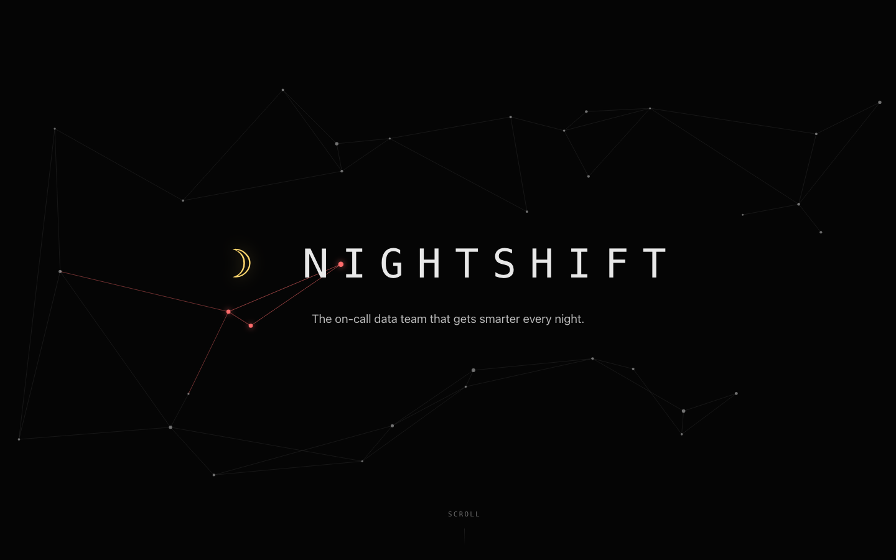
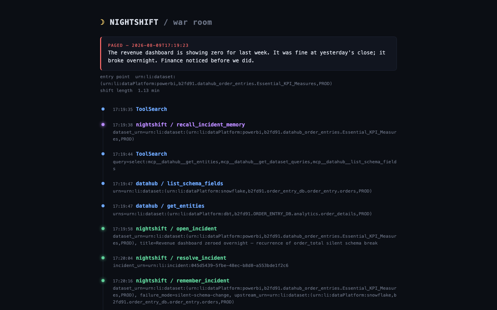
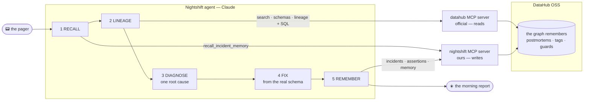

# 🌙 Nightshift

**The on-call data team that gets smarter every night.**

[Live demo](https://nightshift.51-91-121-153.sslip.io) · [Break it yourself](https://try.nightshift.51-91-121-153.sslip.io) · Video (coming) · [Upstream PR datahub-skills#126](https://github.com/datahub-project/datahub-skills/pull/126) · [Apache 2.0](LICENSE)



At 2:47am an upstream team renames a column and tells nobody. By 9:07am the
revenue dashboard reads zero, and Finance notices before the data team does.
Nightshift takes that pager: a Claude agent wired into your
[DataHub](https://datahubproject.io) graph works the incident like a senior
engineer — and then does the thing humans never have time to do at 4am: **it
writes down what it learned, inside the graph itself.**

The second time a pipeline breaks the same way, Nightshift does not
investigate. It remembers. **An investigation becomes a lookup.**



## The night, in numbers

Measured on DataHub's showcase-ecommerce datapack (1,049 entities), from the
replayable shift reports in [`examples/shift-reports/`](examples/shift-reports/):

| | Night 1 (cold) | Night N (memory) |
|---|---|---|
| Investigation tool calls | 14 | 5 — including exactly the 2 reads memory prescribed |
| Time to root cause | 2.2 min | 1.1 min |
| Lineage re-walked | full path | none |

By night 3 the agent recognized a recurrence, reframed the incident from a SQL
problem to a process problem, escalated to the model's owner, and proposed a
dbt source test so CI would block the regression — see the real draft PR:
[nightshift-dbt-demo#1](https://github.com/Mossab28/nightshift-dbt-demo/pull/1).

## Architecture



The official `mcp-server-datahub` covers the read surface completely. It has
no write surface for the on-call loop — no incidents, no assertions, no
memory. The Nightshift MCP server is that missing write surface, built on the
OSS GraphQL API and metadata model, and
[upstreamed as a skill PR](https://github.com/datahub-project/datahub-skills/pull/126)
(plus a [packaging bug report](https://github.com/datahub-project/datahub/issues/19028)
found along the way). Full detail in [docs/architecture.md](docs/architecture.md).

## What the agents leave behind

Open the DataHub UI after a shift and every conclusion is already there, in
the surfaces your team uses today:

- **The incident**, raised *and resolved in DataHub* (`open_incident` / `resolve_incident`).
- **The postmortem**, written into the dataset's documentation — prose for the human at 9am.
- **A machine-readable memory**, a structured property in JSON — for the next agent.
- **A searchable failure-mode tag** — for everyone, via `find_datasets_with_failure_mode`.
- **An external assertion** guarding the column that broke, visible in the
  Validations tab (`guard_column`) — the same silent break can never happen
  twice without someone being told.
- **A concrete fix**: a dbt change built from the columns the catalog actually
  holds — [a real draft PR](https://github.com/Mossab28/nightshift-dbt-demo/pull/1).

Nightshift itself is stateless. The memory lives in DataHub aspects, so it
survives restarts and model changes — and any MCP-capable agent pointed at the
same graph inherits it.

## One incident, whole-graph immunity

When a shift closes, Nightshift asks the graph one more question: *where else
does this exact exposure exist?* `immunize_graph` finds every dataset carrying
the same column — across platforms — and leaves an idempotent guard on each
one. On the demo graph, one incident guarded 11 datasets over dbt, Looker,
PowerBI, S3 and Postgres in a single call: datasets that never broke are
immunized by an incident they never had.

## The Sentinel

Nobody presses the button. The Sentinel fingerprints the schema of every
watched dataset on an interval; when a column moves — renamed, dropped,
retyped — it names the drift and wakes the night shift itself
(`trigger: sentinel`). The loop closes without a human pager at all.

## Quick start

Prerequisites: Docker with ~8 GB of memory, and either an authenticated
`claude` CLI or an `ANTHROPIC_API_KEY`.

```bash
make up datapack   # DataHub + a realistic 1,049-entity enterprise graph
make setup         # install Nightshift
make demo          # silently break the pipeline, hand the agent the pager
```

`make demo` renames an upstream column, tells nobody, and prints the morning
report when the shift ends. `nightshift war-room` renders the night as a
single dark page. Replayable shift reports and postmortems live in
[`examples/`](examples/).

## Built on

The [DataHub MCP Server](https://github.com/acryldata/mcp-server-datahub) and
the DataHub Agent Context Kit — Nightshift adds the write surface OSS agents
were missing and gives it back upstream.

## License

[Apache 2.0](LICENSE)
